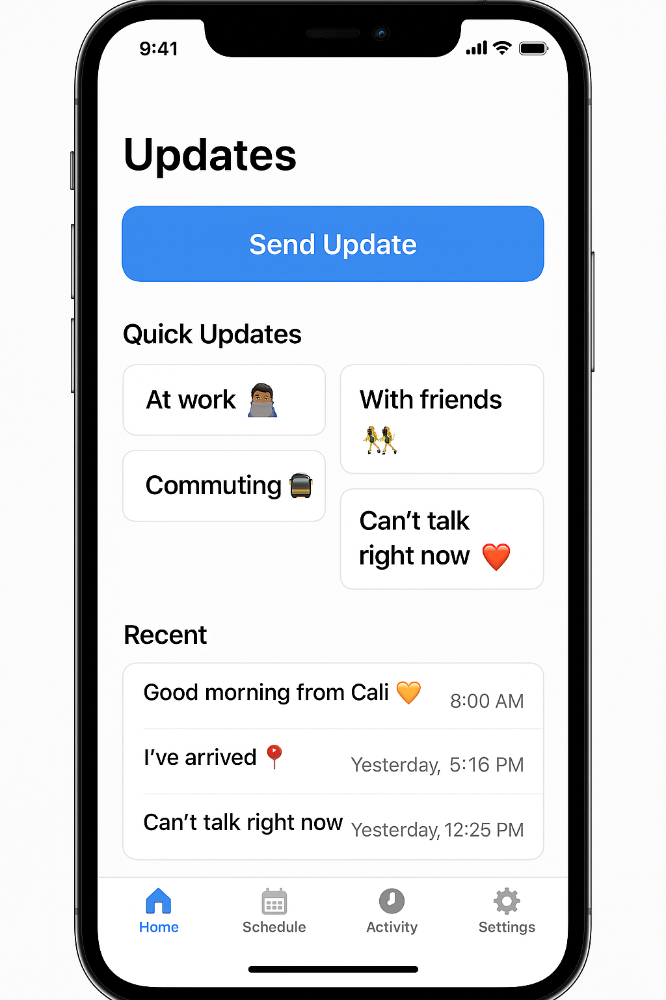
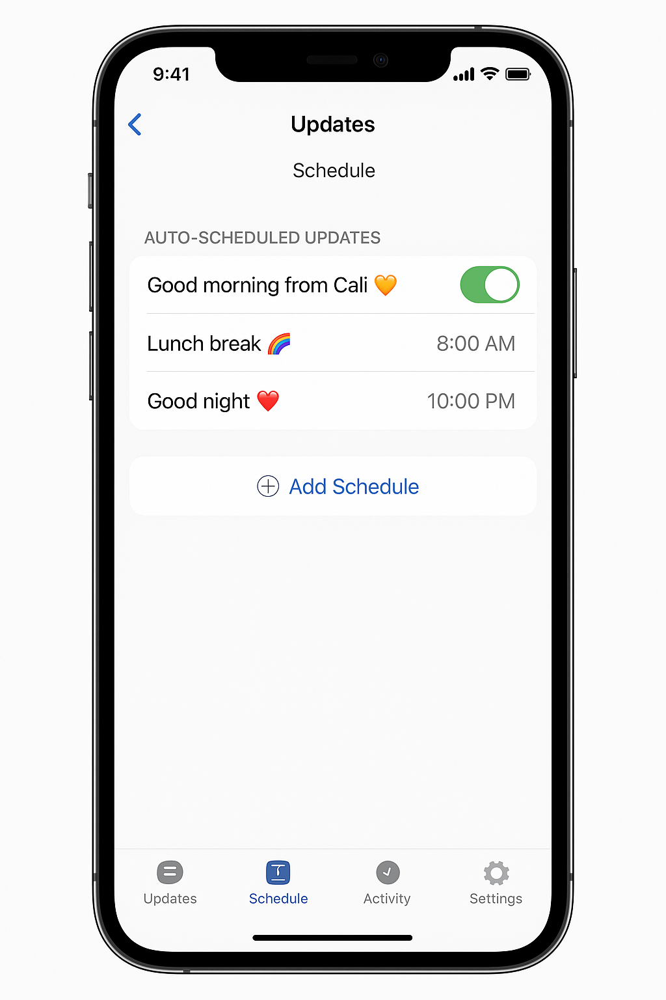

# UpdateMe

## Table of Contents
- [Overview](#overview)
- [Product Spec](#product-spec)
- [Wireframes](#wireframes)
- [Schema](#schema)

## Overview

### Description
UpdateMe is an iOS app designed for people in long-distance relationships who want to stay connected without being glued to their phones. The app enables users to send quick one-tap status updates, schedule auto-messages (like "Good morning" or "I made it home"), and view their partner's recent check-ins—all while respecting real-world social presence.

### App Evaluation

- **Category:** Social / Lifestyle
- **Mobile:** This app is primarily for mobile use and is built natively using Swift, UIKit, and Storyboards.
- **Story:** The user opens the app to quickly send an update, check their partner's recent activity, or schedule future check-ins.
- **Market:** Ideal for couples, close friends, or family members in different locations or time zones.
- **Habit:** The app encourages consistent but low-effort engagement, forming daily habits like morning/night check-ins.
- **Scope:** While simple at its core, it has room for expansion with features like mood updates, audio messages, or shared journals.

## Product Spec

### 1. User Stories

#### ✅ Required Must-have Stories
- User can schedule auto-updates (e.g., “Good morning” at 8 AM)
- User can send one-tap status updates (e.g., “At work”)
- User can view a feed of their recent updates
- Partner profile displays recent updates and availability status
- Local data is saved and persists across sessions
- Users can create, edit, or delete custom schedules

#### ⭐ Optional Nice-to-have Stories
- Mood slider to quickly express how the user feels
- Audio message support (record and send)
- Shared countdown timer to next meetup
- Outfit suggestion feature for hangouts (from Fashion AI idea)
- Interactive notifications (respond from lock screen)

### 2. Screen Archetypes

- **Home Screen**
  - [x] One-tap status update buttons
  - [x] List of recent updates

- **Schedule Screen**
  - [x] Create/edit custom auto-updates
  - [x] View all scheduled items
  - [x] Enable/disable toggle for visibility

- **Partner Profile**
  - [x] View partner’s status and last update
  - [x] Color-coded status circle (busy, idle, free)

- **Onboarding/Welcome (future)**
  - [ ] Option to link with partner account
  - [ ] App setup and permissions

### 3. Navigation

#### Tab Navigation (Tab to Screen)
- Home → Home screen with status buttons
- Schedule → Custom update scheduler
- Profile → Partner profile view

#### Flow Navigation (Screen to Screen)
- Home → View detailed update history (future)
- Schedule → Add/Edit update
- Partner Profile → Mood slider (stretch feature)

## Wireframes

### 📸 Hand-Drawn Wireframes
(Include your hand-drawn wireframe images in this section. Example below:)

### [BONUS] Digital Wireframes & Mockups
(Insert screenshots of your Xcode Storyboard or Figma mockups if any.)

## Schema

*This section will be completed in Unit 9, but here's a draft to get started.*

### Models

#### Update
| Property     | Type    | Description                    |
|--------------|---------|--------------------------------|
| id           | String  | Unique identifier              |
| message      | String  | Content of update              |
| time         | String  | Time to send the update        |
| isAuto       | Bool    | Whether it was auto-sent       |
| isVisible    | Bool    | If visible to partner          |

#### Status
| Property     | Type    | Description                    |
|--------------|---------|--------------------------------|
| id           | String  | Unique ID                      |
| label        | String  | Status label (e.g., "At work") |
| emoji        | String  | Optional icon for display      |

### Networking
*No external API used yet, all data is stored locally via JSON/UserDefaults.*

