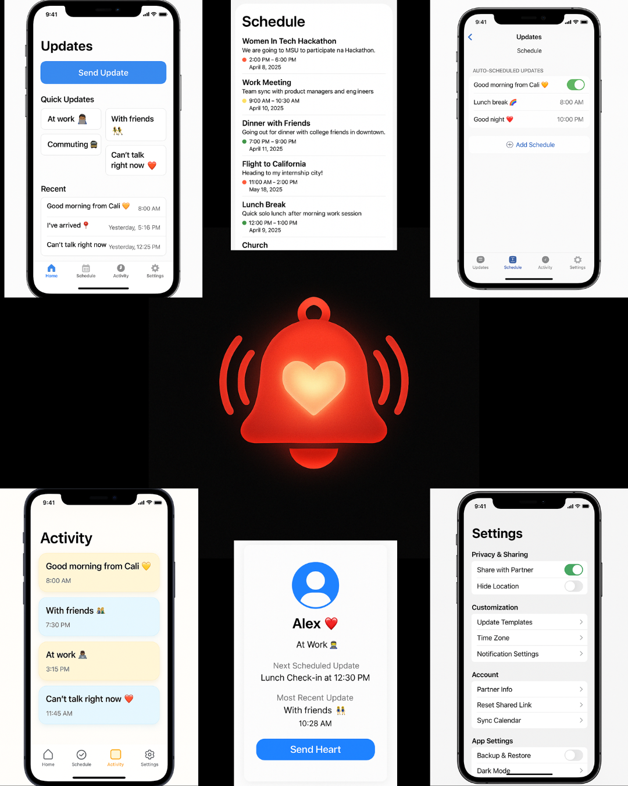

# UpdateMe

## Table of Contents
- [Overview](#overview)
- [Product Spec](#product-spec)
- [Wireframes](#wireframes)
- [Schema](#schema)

## Overview

### Description
UpdateMe is an iOS app designed for people in long-distance relationships who want to stay connected without constantly being on their phones. It supports quick one-tap status updates, scheduled auto-messages, partner activity viewing, and customizable settings—all while respecting cultural values of presence.

### App Evaluation

- **Category:** Social / Lifestyle
- **Mobile:** Native iOS app built with Swift, UIKit, and Storyboard
- **Story:** Users stay emotionally connected with their partner through scheduled and quick updates
- **Market:** For couples, friends, or family members living far apart
- **Habit:** Encourages daily use through morning/night check-ins and real-time status updates
- **Scope:** Scalable with features like voice notes, shared countdowns, mood sliders, and journaling

## Product Spec

### 1. User Stories

#### Required Must-have Stories
- User can send one-tap quick updates (preset statuses)
- User can write and send a custom update with text, image, note, audio, and optional expiration
- User can schedule automated recurring updates (morning/night, etc.)
- Partner profile shows current status and last update
- Activity feed displays partner’s update history
- All updates and schedules are saved locally using UserDefaults

#### Optional Nice-to-have Stories
- Audio message support
- Mood slider with emoji
- Shared countdown widget
- Privacy toggles (e.g. location off)
- Theme/dark mode selection

### 2. Screen Archetypes

- **Home Tab**
  - One-tap preset status buttons
  - Custom update form

- **Schedule Tab**
  - Form to schedule recurring updates
  - Edit/delete/toggle schedules

- **Activity Tab**
  - Feed of recent updates from partner
  - Full view with message, date, image, audio

- **Settings Tab**
  - Time zone and privacy settings
  - Partner info management
  - Enable/disable features like location use, dark mode, backup

### 3. Navigation

#### Tab Navigation (Tab to Screen)
- Home → Quick & custom update options, partner status
- Schedule → Create/edit/delete/update schedule list
- Activity → View feed of partner's updates
- Settings → Manage app preferences

#### Flow Navigation (Screen to Screen)
- Partner status → Partner detail screen (recent + next update)
- Home → Custom update form
- Schedule → Auto-schedule form
- Settings → Preferences (dark mode, privacy, etc.)

### 📸 Wireframes

- You can find more wireframes in the wireframes folder

## Demo Video

https://github.com/user-attachments/assets/5e9e09e9-8f09-4d0f-bde5-27accd253c1e

## Schema

### Models

#### Update
| Property     | Type    | Description                    |
|--------------|---------|--------------------------------|
| id           | String  | Unique identifier              |
| message      | String  | Content of update              |
| time         | String  | Time to send the update        |
| note         | String  | Optional note attached         |
| image        | Data    | Optional image                 |
| audio        | Data    | Optional audio file            |
| isAuto       | Bool    | Whether the update is scheduled|
| isVisible    | Bool    | If visible to partner          |

#### Status
| Property     | Type    | Description                    |
|--------------|---------|--------------------------------|
| id           | String  | Unique ID                      |
| label        | String  | Status label (e.g., "At work") |
| emoji        | String  | Associated emoji icon          |

### Networking

No backend API used. All update and partner data are stored locally via JSON or `UserDefaults`.

## Development Process Summary

### What Has Been Done

[x] Project set up with 4 main tabs: Home, Schedule, Activity, Settings

[x] Tab Bar navigation implemented using UIKit and Storyboard

[x] Home tab supports quick preset and custom updates

[x] Partner profile screen displays status and recent update

[x] Partner detail screen shows last and upcoming scheduled update

[x] Schedule tab supports auto-messages with form, edit, delete, and toggle features

[x] Activity tab displays recent partner updates with message, image, audio

[x] Settings screen implemented with time zone, partner info, and preference toggles

[x] Used UserDefaults and mock JSON data to simulate real-time app behavior

[x] Final project uploaded to GitHub

### To Be Done

[ ] Add backend integration using frameworks like Firebase or Convex

[ ] Implement login and registration functionality

[ ] Make settings features fully functional (toggle effects, data persistence, etc.)

[ ] Add onboarding screen for partner pairing and permissions

[ ] Improve accessibility (dynamic text sizing, VoiceOver labels)

[ ] Test across multiple devices and screen sizes for responsiveness

[ ] Add local notifications for reminders or scheduled update confirmations

### GitHub Note
Development occurred locally during the 2-week sprint. GitHub was used to upload the complete and tested project after all features were finalized.

